[TOC]
##UI视图相关面试问题
###UITableView相关
####重用机制
####数据源同步
要根据具体业务场景来选择不同实现方案。
- 并发访问、数据拷贝

> **缺点是有数据同步操作，还要对数据源进行copy，内存开销更大**

```sequence
Note over 主线程: 数据拷贝
主线程->子线程: 
Note over 主线程: 删除一行数据\nreload UI
主线程->主线程: 记录删除操作 ✅
Note over 子线程: 网络请求、数据解析、预排版等
Note over 主线程: other work
子线程->子线程: 同步删除操作 ✅
Note over 主线程: Note over 主线程
子线程->主线程: 
Note over 主线程: reload UI ❌
```
- 串行访问

> **缺点是子线程处理耗时任务，删除动作会有延时**

```sequence
participant 主线程
participant 串行队列
participant 子线程
Note over 子线程: 网络请求，数据解析
子线程->串行队列:
Note over 串行队列: 新增数据预排版等
Note over 主线程: 删除某一行
Note over 主线程: Waiting
主线程-->串行队列:  
串行队列->串行队列:同步数据删除 ✅
串行队列->主线程:  
Note over 主线程: reload UI
```

###事件传递&视图响应
####UIView和CALayer


`UIView` 里包含 `layer` 属性和 `backgroudColor`属性，`layer` 为 `CALayer` 类型，`backgroudColor`是 `CALayer` 同名属性的包装，`UIView` 的显示部分是由 `CALayer` 的 `contents` 决定的，对应的是 `backing store` 是一个 `bitmap` 的位图。提现的系统设计`UIView` 和 `CALayer` 的单一职责原则。
- `UIView` 为其提供内容，以及负责处理触摸等时间，参与响应链
- `CALayer` 负责显示内容 `contents`

####事件传递与视图响应链


点击了 C2 的区域
事件传递主要和这两个方法有关
`- (UIView *)hitTest:(CGPoint)point withEvent:(nullable UIEvent *)event;`
return UIView，表示最终哪个视图响应这个事件，就把哪个视图返回
 `- (BOOL)pointInside:(CGPoint)point withEvent:(nullable UIEvent *)event;`
return BOOL，表示判断某一个点击位置是否在当前视图范围内
####事件传递流程

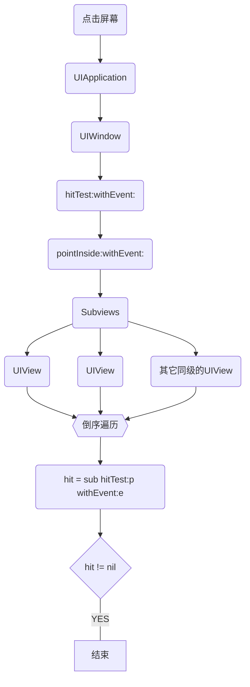
####hitTest:withEvent:系统实现
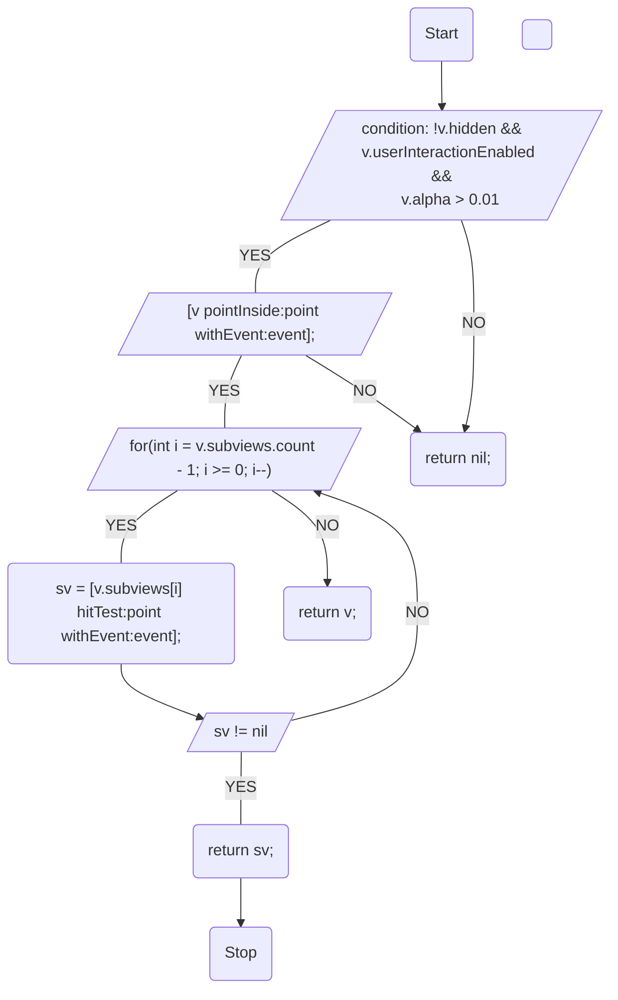
####代码实现
- 方形按钮指定区域接受事件响应
 

```
- (UIView *)hitTest:(CGPoint)point withEvent:(UIEvent *)event
{
    if (!self.userInteractionEnabled ||
        [self isHidden] ||
        self.alpha <= 0.01) {
        return nil;
    }
    
    if ([self pointInside:point withEvent:event]) {
        //遍历当前对象的子视图
        __block UIView *hit = nil;
        [self.subviews enumerateObjectsWithOptions:NSEnumerationReverse usingBlock:^(__kindof UIView * _Nonnull obj, NSUInteger idx, BOOL * _Nonnull stop) {
            // 坐标转换
            CGPoint vonvertPoint = [self convertPoint:point toView:obj];
            //调用子视图的hittest方法
            hit = [obj hitTest:vonvertPoint withEvent:event];
            // 如果找到了接受事件的对象，则停止遍历
            if (hit) {
                *stop = YES;
            }
        }];
        
        if (hit) {
            return hit;
        }
        else{
            return self;
        }
    }
    else{
        return nil;
    }
}

- (BOOL)pointInside:(CGPoint)point withEvent:(UIEvent *)event
{
    CGFloat x1 = point.x;
    CGFloat y1 = point.y;
    
    CGFloat x2 = self.frame.size.width / 2;
    CGFloat y2 = self.frame.size.height / 2;
    
    double dis = sqrt((x1 - x2) * (x1 - x2) + (y1 - y2) * (y1 - y2));
    // 67.923
    if (dis <= self.frame.size.width / 2) {
        return YES;
    }
    else{
        return NO;
    }
}
```
####视图响应流程

`- (void)touchesBegan:(NSSet<UITouch *> *)touches withEvent:(nullable UIEvent *)event;`
`- (void)touchesMoved:(NSSet<UITouch *> *)touches withEvent:(nullable UIEvent *)event;`
`- (void)touchesEnded:(NSSet<UITouch *> *)touches withEvent:(nullable UIEvent *)event;`
###图像显示原理


创建 `UIView` 之后，显示部分由 `CALayer` 负责，`CALayer` 中有 `contents` 属性，例如创建的是 `UILabel`，`contents` 内部放置的是 `Hello World` 文字的位图，系统会在合适的时机回调 `drawRect:` 方法，可以重写此方法来自定义绘制内容，绘制好的位图经由 `Core Animation` 框架，提交给 GPU 部分的 `OpenGL` 渲染管线进行最终的渲染、纹理合成，显示到屏幕上。
####CPU工作
- Layout（UI布局、文本计算）
- Display（绘制）
- Prepare [^sample_footnote]（图片编解码）
- Commit（提交位图）

####GPU渲染管线
- 顶点着色
- 图元装配
- 光栅化
- 片段着色
- 片段处理

###UI卡顿、掉帧的原因
在规定的16.7毫秒内，在下一帧 VSync 到来之前，并没有 CPU、GPU共同完成下一帧画面的合成，于是就会导致卡顿、掉帧。
####滑动优化方案
- CPU
    - 对象创建、**调整**、**销毁**等可以放到子线程去操作
    - 预排班（布局计算、文本计算）
    - **预渲染（文本等异步绘制，图片编解码等）**
- GPU
    - **纹理渲染**（例如触发离屏渲染，如layer圆角、阴影等），可以尽量避免离屏渲染，可以依托 CPU 的异步绘制机制来减轻 GPU 压力
    - **视图混合**（例如视图层级复杂），可以减轻视图层级复杂性，也可以依托 CPU 异步绘制机制

###UIView的绘制原理
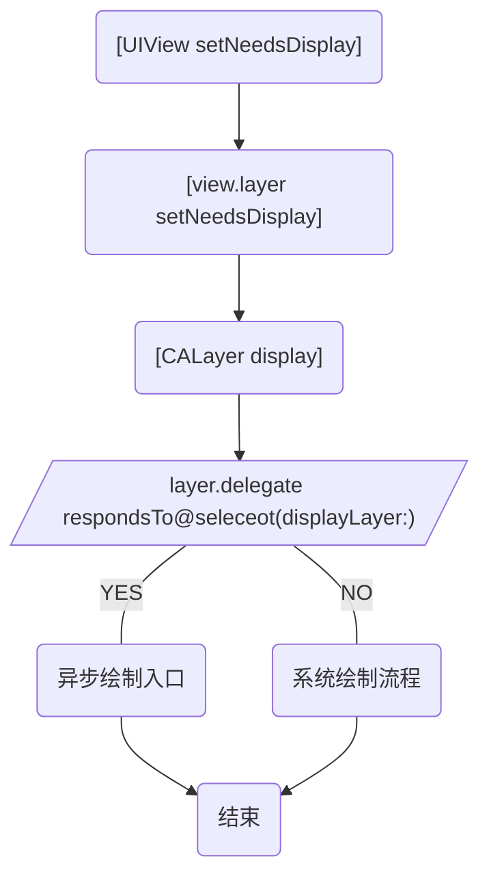
- `UIView` 调用`setNeedsDisplay`后
- 系统会立刻调用`view`所对应 `layer` 的同名方法，相当于在 `layer` 上打上脏标记
- 在当前 `runloop` 将要结束时，调用 `CALayer` 的 `dispaly` 方法，进入到当前视图真正的绘制流程当中
- display 内部实现当中，先判断`layer.delegate`是否响应 `displayLayer`方法
- 如果响应`displayLayer`，就相当于提供了异步绘制的入口
- 如果不响应`displayLayer`方法，就会进入到系统绘制流程

####系统绘制流程
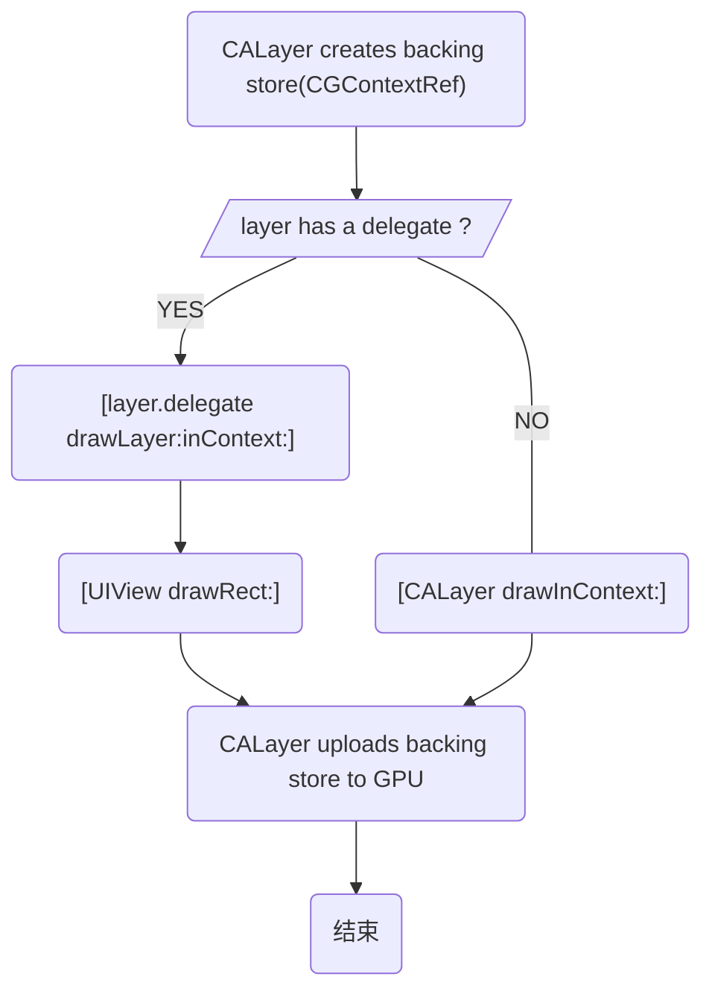
- `CALayer` 内部会创建一个 `backing store`，可以理解为是 `CGContextRef`
- `layer` 会判断是否有代理
- 如果有代理，会调用`drawLayer:inContext:`方法，做当前视图的绘制工作（发生在系统内部），在合适时机回调`drawRect:`方法
- 如果没有代理，会调用 `CALayer` 的 `drawInContext:`
- 由`CALayer`上传对应的 `backing store` 到 GPU

####异步绘制
如果实现了`displayLayer:`，就可以进行异步绘制
在异步绘制中
- 代理负责生成对应的 `bitmap`
- 设置该 `bitmap` 作为 `layer.contents` 属性的值

```sequence
Note over main queue: [AsyncDrawingView setNeedsDisplay]
Note over main queue: [CALayer display]\n \n[AsyncDrawingView displayLayer:]
main queue->Global queue: 
Note over Global queue: CGBitmapContextCreate()
Note over main queue: other works 
Note over Global queue: CoreGraphic API
Note over Global queue: CGBitmapContextCreateImage()
Global queue->main queue: 
Note over main queue: [CALayer setContents:]
```
###离屏渲染

####什么是离屏渲染？
- 当我们指定了 UI 视图的某些属性，标记为它在位于合成不能用于当前屏幕直接显示的时候，就会触发离屏渲染。
- 而离屏渲染的概念起源于 **GPU** 层面，指的是当前屏幕缓冲区以为**新开辟**一个缓冲区进行渲染操作

####合适会触发？
- 圆角（当和 maskToBounds 一起使用是时
- 图层蒙版
- 阴影
- 光栅化

####为何要避免离屏渲染？
- 在触发离屏渲染时，会增加 GPU 工作量，很有可能导致 CPU+GPU 的总耗时超出 16.7 毫秒，从而导致了 UI 的卡顿和掉帧
- 创建新的渲染缓冲区
- 上下文切换

##Objective-C语言特性相关面试问题
###分类
####你用分类都做了那些事？
- 声明私有方法
- 分解体积庞大的类文件
- 把 Framework 的私有方法公开

####特点
- 运行时决议
- 可以为系统类添加分类

####分类中都可以添加哪些内容
- 实例方法
- 类方法
- 协议
- 属性

```
// objc-runtime-680版本
struct category_t {
const char *name;// 分类的名称
classref_t cls;// 分类所属的宿主类
struct method_list_t *instanceMethods;// 实例方法的列表
struct method_list_t *classMethods;// 类方法的列表
struct protocol_list_t *protocols;// 协议
struct property_list_t *instanceProperties;// 实例属性

method_list_t *methodsForMeta (bool isMeta) {
    if (isMeta) return classMethods;
    else return instanceMethods;
}
property_list_t *propertiesForMeta(bool isMeta) {
    if (isMeta) return nil; // classProperties;
    else return instanceProperties;
}
```
####加载调用栈
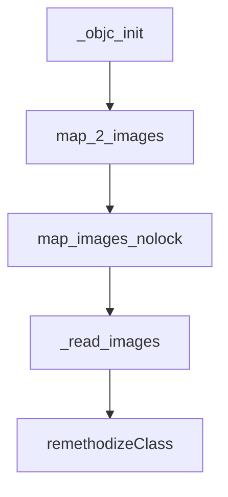
```
static void remethodizeClass(Class cls)
{
    category_list *cats;
    bool isMeta;

    runtimeLock.assertLocked();
    // 只分析分类中实力方法添加的逻辑，因此假设 isMeta = NO
    isMeta = cls->isMetaClass();

    // Re-methodizing: check for more categories
    // 获取 cls 中未完成整合的所有分类
    if ((cats = unattachedCategoriesForClass(cls, false/*not realizing*/))) {
        if (PrintConnecting) {
            _objc_inform("CLASS: attaching categories to class '%s' %s", 
                         cls->nameForLogging(), isMeta ? "(meta)" : "");
        }
        // 将分类 cats 拼接到 cls 上
        attachCategories(cls, cats, true /*flush caches*/);        
        free(cats);
    }
}

static void 
attachCategories(Class cls, category_list *cats, bool flush_caches)
{
    if (!cats) return;
    if (PrintReplacedMethods) printReplacements(cls, cats);
    // 只分析分类中实力方法添加的逻辑，因此假设 isMeta = NO
    bool isMeta = cls->isMetaClass();
    
    // fixme rearrange to remove these intermediate allocations
    /*
    [[method_t,method_t,...],[method_t],[method_t,method_t,method_t],...]
    */
    method_list_t **mlists = (method_list_t **)
        malloc(cats->count * sizeof(*mlists));
    property_list_t **proplists = (property_list_t **)
        malloc(cats->count * sizeof(*proplists));
    protocol_list_t **protolists = (protocol_list_t **)
        malloc(cats->count * sizeof(*protolists));

    // Count backwards through cats to get newest categories first
    int mcount = 0;
    int propcount = 0;
    int protocount = 0;
    int i = cats->count;// 宿主类分类的总数
    bool fromBundle = NO;
    while (i--) {// 这里是倒序遍历，最先访问最后编译的分类
        // 获取一个分类
        auto& entry = cats->list[i];
        // 获取该分类的方法列表
        method_list_t *mlist = entry.cat->methodsForMeta(isMeta);
        if (mlist) {
            // 最后编译的分类最先添加到分类数组中
            mlists[mcount++] = mlist;
            fromBundle |= entry.hi->isBundle();
        }
        // 属性列表添加规则 同方法列表添加规则
        property_list_t *proplist = 
            entry.cat->propertiesForMeta(isMeta, entry.hi);
        if (proplist) {
            proplists[propcount++] = proplist;
        }
        // 属性列表添加规则 同方法列表添加规则
        protocol_list_t *protolist = entry.cat->protocols;
        if (protolist) {
            protolists[protocount++] = protolist;
        }
    }
    // 获取宿主类当中的 rw 数据，其中包含宿主类的方法列表信息
    auto rw = cls->data();
    // 主要是针对 分类中有关于内存管理相关方法情况下的 一些特殊处理
    prepareMethodLists(cls, mlists, mcount, NO, fromBundle);
    /*
    rw 代表类
    methods 代表类的方法列表
    attachLists 方法的含义是：将含有 mcount 个元素的 mlists 拼接到 rw 的 methods 上
    */
    rw->methods.attachLists(mlists, mcount);
    free(mlists);
    if (flush_caches  &&  mcount > 0) flushCaches(cls);

    rw->properties.attachLists(proplists, propcount);
    free(proplists);

    rw->protocols.attachLists(protolists, protocount);
    free(protolists);
}

/*
    attachLists 传递过来的二维数组
    [[method_t,method_t,...],[method_t],[method_t,method_t,method_t],...]
    ------------------------ ---------- ---------------------------------
       分类A中的方法列表（A）        B                    C
       addedCount = 3
    */
void attachLists(List* const * addedLists, uint32_t addedCount) {
    if (addedCount == 0) return;

    if (hasArray()) {
        // many lists -> many lists
        // 列表中原有元素总数 oldCount = 2
        uint32_t oldCount = array()->count;
        // 拼接之后的元素总数
        uint32_t newCount = oldCount + addedCount;
        // 根据新总数重新分配内存
        setArray((array_t *)realloc(array(), array_t::byteSize(newCount)));
        array()->count = newCount;
        memmove(array()->lists + addedCount, array()->lists, 
                oldCount * sizeof(array()->lists[0]));
        memcpy(array()->lists, addedLists, 
                addedCount * sizeof(array()->lists[0]));
    }
    else if (!list  &&  addedCount == 1) {
        // 0 lists -> 1 list
        list = addedLists[0];
    } 
    else {
        // 1 list -> many lists
        List* oldList = list;
        uint32_t oldCount = oldList ? 1 : 0;
        uint32_t newCount = oldCount + addedCount;
        setArray((array_t *)malloc(array_t::byteSize(newCount)));
        array()->count = newCount;
        if (oldList) array()->lists[addedCount] = oldList;
        memcpy(array()->lists, addedLists, 
                addedCount * sizeof(array()->lists[0]));
    }
}
```

###关联对象
###扩展、代理
###KVO、KVC
###NSNotification
###属性关键字
##Runtime相关面试问题
###对象、类对象、元类对象
###消息传递机制
###消息转发流程
###方法缓存
###Method-Swizzling
###动态添加方法
##内存管理相关面试问题
###ARC
###MRC
###引用计数机制
###弱引用表
###AutoReleasePool
###循环引用
##Block相关面试问题
###Block的本质
###截获变量特性
###__block修饰符的本质
###Block的内存管理
###循环引用
##多线程相关面试问题
###GCD
###NSOperation/NSOperationQueue
###NSThread
###线程同步、资源共享
###互斥锁、自旋锁、递归锁等
##RunLoop相关面试问题
###什么是RunLoop？
###Mode/Source/Timer/Observer
###事件循环机制
###RunLoop与NSTimer
###RunLoop与线程之间的关系
###常驻线程
##网络相关面试问题

###HTTP协议
HTTP 的请求方式有 GET、POST、HEAD、PUT、DELTTE、OPTIONS 六种
####请求报文
- 请求行
    - 方法（例如 Get、Post）
    - URL（服务器地址）
    - 协议版本（HTTP 1.1）
- 首部字段（以 key：value）
- 实体主体（Get 请求没有实体主体，Post 有）

####响应报文
- 响应行
    - 版本
    - 状态码
    - 短语
- 首部字段（以 key：value）
- 实体主体

####GET 和 POST 方式的区别
从语义的角度来回答：
- GET：获取资源，**安全的**、**幂等的**、**可缓存的**
- POST：处理资源，**非安全的**、**非幂等的**、**不可缓存的**

> 安全性：不应该引起 Server 端的任何状态变化（例如 GET、HEAD、OPTIONS）
> 幂等性：同一个请求方法执行多次和执行一次的效果完全相同（例如 PUT、DELETE）
> 可缓存性：请求是否可以被缓存（例如 GET、HEAD）

通常回答：
- GET 请求参数以？分割拼接到 URL 后面，POST 请求参数在 Body 里
- GET 参数长度限制 2048 个字符，POST一般没有该限制
- GET 请求不安全，POST 请求比较安全

####状态码
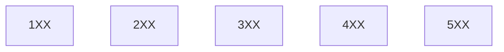
- 200响应成功
- 301、302发生网络重定向
- 401、404客户端发起的请求存在问题
- 501、502服务端有异常

####连接建立流程
```sequence
participant Client
participant Server
Note over Client: 三次握手
Note over Server: TCP
Client->Server: SYN同步报文
Server->Client: SYN，ACK同步报文
Client->Server: ACK
Note over Server: HTTP
Client->Server: http 请求报文
Server->Client: http 响应报文
Note over Client: 四次挥手
Note over Server: TCP
Client->Server: FIN终止报文
Server->Client: ACK确认报文
Server->Client: FIN，ACK同步报文
Client->Server: ACK
```

**首先需要通过 TCP 的三次握手来建立连接，之后在这条连接上面进行 http 请求、响应，之后经历 TCP 的四次挥手进行连接释放。**

####HTTP的特点
- 无连接，可以通过 **HTTP的持久连接** 补偿
- 无状态，可以通过 **Cookie/Session** 补偿

#####持久连接
为了提升网络请求响应效率
- 头部字段
    - Connection：keep-alive
    - time：20（20秒内不会四次挥手关闭）
    - max：10（这条连接最多可以发生多少个 http 请求和响应对）

怎样判断一个请求是否结束？
- Content-length：1024，根据所接收的字节数是否到达该值
- chunked，当有多个块通过 http 的 tcp 连接传输给客户端时，每一个报文都会带有 chunked 字段，最后一个 chunked 是空的。根据哪一个chunked 是空的来判断前一个网络请求是否结束

####Charles抓包原理
利用了 http 的中间人攻击漏洞来实现的。

###HTTPS与网络安全
####HTTPS和HTTP有什么区别？
HTTPS = HTTP + SSL/TLS

**IP 是网络层，TCP 是传输层，HTTP 是应用层，SSL/TLS 是协议中间层。** 
HTTPS 就是在 HTTP 和 TCP 中间插入了 SSL/TLS 来实现网络安全的机制。
- HTTPS 是安全的 HTTP，安全是由 SLL/TLS 插在应用层之下，传输层之上的协议来保障的。

####HTTPS连接建立流程是怎样的？

```sequence
participant Client
participant Server

Client->Server: TLS版本号，支持的加密算法，random number C
Server->Client: 商定的加密算法，random number S，server证书
Client->Client: 验证server证书
Client->Client: 组装会话秘钥
Client->Server: 通过server的公钥对预主秘钥进行加密传输
Server->Server: 通过私钥解密得到预主秘钥
Server->Server: 组装会话秘钥
Client->Server: 加密的握手消息
Server->Client: 加密的握手消息
```

> 1. 客户端会发送给服务端一个支持的加密算法列表，包括 TLS 版本号，以及随机数 C
> 2. 然后服务端再会给客户端一个服务端的证书，包括商定的加密算法
> 3. 后续首先通过非对称加密进行对称加密秘钥的传输
> 4. 之后 HTTP 之间的网络请求就通过被非对称加密所保护的对称秘钥进行后续的网络访问


#####什么是会话秘钥
    - 会话秘钥（对称加密的秘钥结果） = random S + random C + 预主秘钥（对称加密的秘钥结果）

#####HTTPS 都使用了哪些加密手段？为什么？
- 连接建立过程使用**非对称加密**，非对称加密很**耗时**
- 后续通信过程使用**对称加密**

#####什么是非对称加密

#####什么是对称加密


###TCP/UDP
二者都是传输层协议，TCP 是传输控制协议，UDP 是用户数据报协议
####UDP（用户数据报协议）
- 特点
    - 无连接
    - 尽最大努力交付
    - 面向报文（既不合并，也不拆分）
- 功能
    - 复用
    - 分用
    - 差错检测

复用、分用


差错检测

####TCP（传输控制协议）
- 特点
    - 面向连接
        - 数据传输开始之前，需要建立连接，**三次握手**
        - 数据传输结束之后，需要释放连接，**四次挥手**
    - 可靠传输
        - 无差错
        - 不丢失
        - 无重复
        - 按序到达
    - 面向字节流
    - 流量控制
    - 拥塞控制
- 功能
    - 

#####三次握手
- 为什么要进行三次握手？
- tcp三次握手的目的是为了解决"网络中存在延迟的重复分组"的问题，也就是**防止已过期的连接再次传到被连接的主机**

如果采用两次的话，会出现下面这种情况：

> 比如是A机要连到B机，结果发送的连接信息由于某种原因没有到达B机；
于是，A机又发了一次，结果这次B收到了，于是就发信息回来，两机就连接。
传完东西后，断开。
结果这时候，原先没有到达的连接信息突然又传到了B机，于是B机发信息给A，然后B机就以为和A连上了，这个时候B机就在等待A传东西过去。

#####四次挥手
因为TCP有个半关闭状态，假设A，B要释放连接，那么A发送一个释放连接报文给B，B收到后发送确认，这个时候A不发数据，但是B如果发数据A还是要接受，这叫半关闭。然后B还要发给A连接释放报文，然后A发确认，所以是4次。
#####可靠传输
可靠传输在 TCP 层面是靠停止等待协议实现的
- 无差错情况


- 超时重传


- 确认丢失


- 确认迟到


#####面向字节流

TCP通过字节流传输，即TCP将应用程序看成是一连串的无结构的字节流。每个TCP套接口有一个发送缓冲区，如果字节流太长时，TCP会将其拆分进行发送。当字节流太短时，TCP会等待缓冲区中的字节流达到一定程度时再构成报文发送出去，TCP发给对方的数据，对方在收到数据时必须给矛确认，只有在收到对方的确认时，本方TCP才会把TCP发送缓冲区中的数据删除。
#####流量控制
滑动窗口协议

当发送数据时，可能由于接收方接收窗口不够大，需要由接收窗口向 TCP 报文首部字段当中去更改窗口值，调整发送方的发送速率。
#####拥塞控制
- 慢开始、拥塞避免
 


**慢开始**是指一开始向网络注入的报文段少，并不是指拥塞窗口cwnd增长速度慢
**拥塞避免**并非指完全能够避免拥塞，而是指在拥塞避免阶段将拥塞窗口控制为按线性规律增长，使网络比较不容易出现拥塞

- 快恢复、快重传

**快恢复**发送方一旦收到3个重复确认，就知道现在只是丢失了个别的报文段。于是不启动慢开始算法，而执行快恢复算法
**快重传**，就是使发送方尽快进行重传，而不是等超时重传计时器超时再重传

###DNS解析
DNS 是域名到 IP 地址的映射，DNS 解析请求采用 UDP 数据报，且明文
####DNS解析查询方法
- 递归查询

客户端只发一次请求，要求对方给出最终结果。


- 迭代查询

客户端发出一次请求，对方如果没有授权回答，它就会返回一个能解答这个查询的其它名称服务器列表，客户端会再向返回的列表中发出请求，直到找到最终负责所查域名的名称服务器，从它得到最终结果。

####DNS解析存在哪些常见的问题
- DNS 劫持问题


> DNS 劫持与 HTTP 的关系是怎样的？
> **完全没有关系**
> DNS 解析发生在 HTTP 建立连接之前
> DNS 解析请求使用 UDP 数据报，端口号 53

- DNS 解析转发


降低专用链路上域名解析的带宽占用
#####怎样解决DNS劫持
- httpDNS

**定义**：不走传统的DNS解析，自己搭建基于HTTP协议的DNS服务器集群，分布在多个地点和多个运营商，当客户端需要DNS解析的时候，直接通过HTTP协议进行请求这个服务器集群，获得就近的地址。

由原本"使用 DNS 协议向 DNS 服务器的 53 端口进行请求"改为"**使用 HTTP 协议向 DNS 服务器的 80 端口进行请求"**

1. 在客户端的SDK里动态请求服务端，获取HTTPDNS服务器的ip列表，缓存到本地。SDK也会在本地缓存DNS域名解析的结果。这个缓存和本地DNS的缓存不一样，不是整个运营商统一做的，而是手机应用来做的，如何更新，何时更新。
2. 如果本地无，就需要请求HTTPDNS的服务器，在本地的ip列表中，选择一个发出HTTP请求，返回一个要访问的网站的ip列表。手机客户端知道手机坐在的运营商，可以精确做到全局负载均衡。

- 长连接


###Session/Cookie
是对HTTP协议无状态特点的补偿
####Cookie
Cookie 主要用来记录用户状态，区分用户；**状态保存在客户端**

**服务端**在**响应报文**的**首部字段**`**Set-Cookie**`把对应内容传给客户端，**客户端**在后续的 http **请求报文**当中，把之前服务端返回给客户端的cookie添加到 http **请求报文**的 `**Cookie**` **首部字段**中，服务端对传来的 cookie 进行判断对用户进行识别

怎样修改 Cookie？
- 新 cookie 覆盖旧 cookie
- 覆盖规则：name、path、domain 等需要与原 cookie 一致

怎样删除 Cookie？
- 新 cookie 覆盖旧 cookie
- 覆盖规则：name、path、domain 等需要与原 cookie 一致
- 设置 cookie 的 **expires = 过去的一个时间点**，或者 **maxAge = 0**

怎样保证 Cookie 的安全？
- 对 cookie 进行加密处理
- 只在 https 上携带cookie
- 设置 cookie 为 httpOnly，防止跨站脚本攻击

####Session
Session 也是用来记录用户状态，区分用户的；状态存在在服务器端。

Session 和 Cookie 的关系是怎样的？
- Session 需要依赖于 Cookie 机制

```sequence
participant Client
participant Server
Client-->Server: 发送信息
Note over Server: 记录用户状态
Note over Server: 生成 SessionID
Server-->Client:  Set-Cookie：sessid = 038ad...
Client-->Server: 发送信息 Cookie：sessid = 038ad...
Note over Server: 通过 sessid 识别用户
```

##设计模式相关面试问题
###六大设计原则
- 单一职责原则
    - 一个类只负责一件事
- 依赖倒置原则
    - 抽象不应该依赖于具体实现，具体实现可以依赖于抽象
- 开闭原则
    - 对修改关闭、对扩展开放
- 里式替换原则
    - 父类可以被子类无缝替换，且原有功能不受任何影响
- 接口隔离原则
    - 使用多个专门的协议，而不是一个庞大臃肿的协议
    - 协议中的方法应当尽量少
- 迪米特法则
    - 一个对象应当对其它对象有尽可能少的了解
    - 高内聚、低耦合

###责任链
####类构成
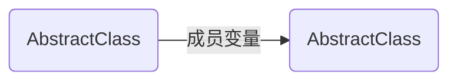
####源码
```
BusinessObject.h

typedef void(^CompletionBlock)(BOOL handled);
typedef void(^ResultBlock)(BusinessObject *handler, BOOL handled);

@interface BusinessObject : NSObject

// 下一个响应者(响应链构成的关键)
@property (nonatomic, strong) BusinessObject *nextBusiness;
// 响应者的处理方法
- (void)handle:(ResultBlock)result;

// 各个业务在该方法当中做实际业务处理
- (void)handleBusiness:(CompletionBlock)completion;
```

```
BusinessObject.m

@implementation BusinessObject

// 责任链入口方法
- (void)handle:(ResultBlock)result
{
    CompletionBlock completion = ^(BOOL handled){
        // 当前业务处理掉了，上抛结果
        if (handled) {
            result(self, handled);
        }
        else{
            // 沿着责任链，指派给下一个业务处理
            if (self.nextBusiness) {
                [self.nextBusiness handle:result];
            }
            else{
                // 没有业务处理, 上抛
                result(nil, NO);
            }
        }
    };
    
    // 当前业务进行处理
    [self handleBusiness:completion];
}

- (void)handleBusiness:(CompletionBlock)completion
{
    /*
     业务逻辑处理
     如网络请求、本地照片查询等
     */
}
```
####关于需求变更的问题
> Q: 假如需求顺序 A->B->C 改为 C->B->A
> A: 使用责任链模式解决需求变更调整的问题，修改责任链中的nextBusiness 的指向来调整顺序

###桥接
关于业务解耦的问题：
**问题：一个列表对应多种网络请求数据你是怎么做的？**
####类构成
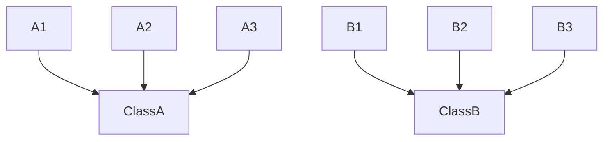
###适配器
###单例
###命令
##架构框架相关面试问题
###图片缓存框架
###时长统计框架
###复杂页面架构
###客户端整体架构
##算法相关面试问题
###字符串反转
- 给定字符串"Helle World"，实现将其反转。输出结果为"dlroW olleH"

```
void char_reverse(char* cha)
{
    // 指向第一个字符
    char* begin = cha;
    // 指向最后一个字符
    char* end = cha + strlen(cha) - 1;
    
    while (begin < end) {
        // 交换前后两个字符,同时移动指针
        char temp = *begin;
        *(begin++) = *end;
        *(end--) = temp;
    }
}
```
###链表反转
反转前
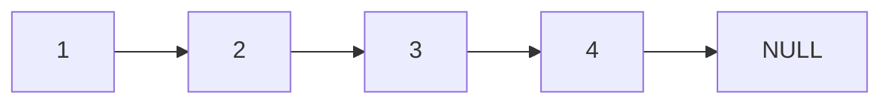
反转后
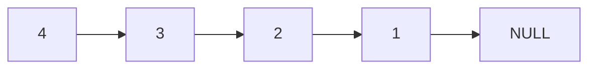
```
struct Node {
    int data;
    struct Node *next;
};
// 链表反转
struct Node* reverseList(struct Node *head)
{
    // 定义遍历指针，初始化为头结点
    struct Node *p = head;
    // 反转后的链表头部
    struct Node *newH = NULL;
    
    // 遍历链表
    while (p != NULL) {
        
        // 记录下一个结点
        struct Node *temp = p->next;
        // 当前结点的next指向新链表头部
        p->next = newH;
        // 更改新链表头部为当前结点
        newH = p;
        // 移动p指针
        p = temp;
    }
    
    // 返回反转后的链表头结点
    return newH;
}
// 构造一个链表
struct Node* constructList(void)
{
    // 头结点定义
    struct Node *head = NULL;
    // 记录当前尾结点
    struct Node *cur = NULL;
    
    for (int i = 1; i < 5; i++) {
        struct Node *node = malloc(sizeof(struct Node));
        node->data = i;
        
        // 头结点为空，新结点即为头结点
        if (head == NULL) {
            head = node;
        }
        // 当前结点的next为新结点
        else{
            cur->next = node;
        }
        
        // 设置当前结点为新结点
        cur = node;
    }
    
    return head;
}
// 打印链表中的数据
void printList(struct Node *head)
{
    struct Node* temp = head;
    while (temp != NULL) {
        printf("node is %d \n", temp->data);
        temp = temp->next;
    }
}
```
###有序数组合并
```
// 将有序数组a和b的值合并到一个数组result当中，且仍然保持有序
void mergeList(int a[], int aLen, int b[], int bLen, int result[])
{
    int p = 0; // 遍历数组a的指针
    int q = 0; // 遍历数组b的指针
    int i = 0; // 记录当前存储位置
    
    // 任一数组没有到达边界则进行遍历
    while (p < aLen && q < bLen) {
        // 如果a数组对应位置的值小于b数组对应位置的值
        if (a[p] <= b[q]) {
            // 存储a数组的值
            result[i] = a[p];
            // 移动a数组的遍历指针
            p++;
        }
        else{
            // 存储b数组的值
            result[i] = b[q];
            // 移动b数组的遍历指针
            q++;
        }
        // 指向合并结果的下一个存储位置
        i++;
    }
    
    // 如果a数组有剩余
    while (p < aLen) {
        // 将a数组剩余部分拼接到合并结果的后面
        result[i] = a[p++];
        i++;
    }
    
    // 如果b数组有剩余
    while (q < bLen) {
        // 将b数组剩余部分拼接到合并结果的后面
        result[i] = b[q++];
        i++;
    }
}
```
###Hash算法
在一个字符串中找到第一个只出现一次的字符。如：输入"abaccdeff"，则输出 b。

####算法思路
- 字符（char）是一个长度为 8 的数据类型，因此总共有256 种可能。
- 每个字母根据其 ASCII 码值作为数组的下标对应数组的一个数字。
- 数组中存储的是每个字符出现的次数。

####哈希表
例：给定值是字母 a，对应 ASCII 值是 97，数组索引下标为 97.
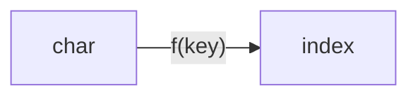
f(key) = key

**存储和查找都通过该函数，有效提高查找效率**
```
// 查找第一个只出现一次的字符
char findFirstChar(char* cha)
{
    char result = '\0';
    // 定义一个数组 用来存储各个字母出现次数
    int array[256];
    // 对数组进行初始化操作
    for (int i=0; i<256; i++) {
        array[i] =0;
    }
    // 定义一个指针 指向当前字符串头部
    char* p = cha;
    // 遍历每个字符
    while (*p != '\0') {
        // 在字母对应存储位置 进行出现次数+1操作
        array[*(p++)]++;
    }
    
    // 将P指针重新指向字符串头部
    p = cha;
    // 遍历每个字母的出现次数
    while (*p != '\0') {
        // 遇到第一个出现次数为1的字符，打印结果
        if (array[*p] == 1)
        {
            result = *p;
            break;
        }
        // 反之继续向后遍历
        p++;
    }
    
    return result;
}
```
###查找两个子视图的共同父视图
倒序比较找到第一个不一样的
```
// 查找两个视图的共同父视图
- (NSArray <UIView *> *)findCommonSuperView:(UIView *)viewOne other:(UIView *)viewOther
{
    NSMutableArray *result = [NSMutableArray array];
    
    // 查找第一个视图的所有父视图
    NSArray *arrayOne = [self findSuperViews:viewOne];
    // 查找第二个视图的所有父视图
    NSArray *arrayOther = [self findSuperViews:viewOther];
    
    int i = 0;
    // 越界限制条件
    while (i < MIN((int)arrayOne.count, (int)arrayOther.count)) {
        // 倒序方式获取各个视图的父视图
        UIView *superOne = [arrayOne objectAtIndex:arrayOne.count - i - 1];
        UIView *superOther = [arrayOther objectAtIndex:arrayOther.count - i - 1];
        
        // 比较如果相等 则为共同父视图
        if (superOne == superOther) {
            [result addObject:superOne];
            i++;
        }
        // 如果不相等，则结束遍历
        else{
            break;
        }
    }
    
    return result;
}

- (NSArray <UIView *> *)findSuperViews:(UIView *)view
{
    // 初始化为第一父视图
    UIView *temp = view.superview;
    // 保存结果的数组
    NSMutableArray *result = [NSMutableArray array];
    while (temp) {
        [result addObject:temp];
        // 顺着superview指针一直向上查找
        temp = temp.superview;
    }
    return result;
}
```

###求无序数组当中的中位数
排序算法+中位数
- 排序算法

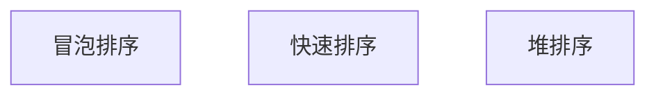

- 中位数
    - 则当 n 为基数时，(n+1)/2;
    - 则当 n 为偶数时，(n/2+(n/2+1))/2;
- 利用快排思想（分治思想）
任意挑一个元素，以该元素为支点，划分集合为两部分。
如果左侧集合长度恰为(n-1)/2，那么支点恰为中位数。
如果左侧长度<(n-1)/2，那么中位点在右侧；反之，中位数在左侧。
进入相应的一侧继续寻找中位点。

```
// 无序数组中位数查找
int findMedian(int a[], int aLen)
{
    int low = 0;
    int high = aLen - 1;
    
    int mid = (aLen - 1) / 2;
    int div = PartSort(a, low, high);
    
    while (div != mid)
    {
        if (mid < div)
        {
            //左半区间找
            div = PartSort(a, low, div - 1);
        }
        else
        {
            //右半区间找
            div = PartSort(a, div + 1, high);
        }
    }
    //找到了
    return a[mid];
}

int PartSort(int a[], int start, int end)
{
    int low = start;
    int high = end;
    
    //选取关键字
    int key = a[end];
    
    while (low < high)
    {
        //左边找比key大的值
        while (low < high && a[low] <= key)
        {
            ++low;
        }
        
        //右边找比key小的值
        while (low < high && a[high] >= key)
        {
            --high;
        }
        
        if (low < high)
        {
            //找到之后交换左右的值
            int temp = a[low];
            a[low] = a[high];
            a[high] = temp;
        }
    }
    
    int temp = a[high];
    a[high] = a[end];
    a[end] = temp;
    
    return low;
}
```

##第三方库相关面试问题
###AFNetWorking
###SDWebImageView
###Reactive Cocoa
###AsyncDisplayKit

<style>
  h2 {text-align: center; color: #368DE7}
</style>

[^sample_footnote]: [prɪˈper] vt. 准备；使适合；装备；起草